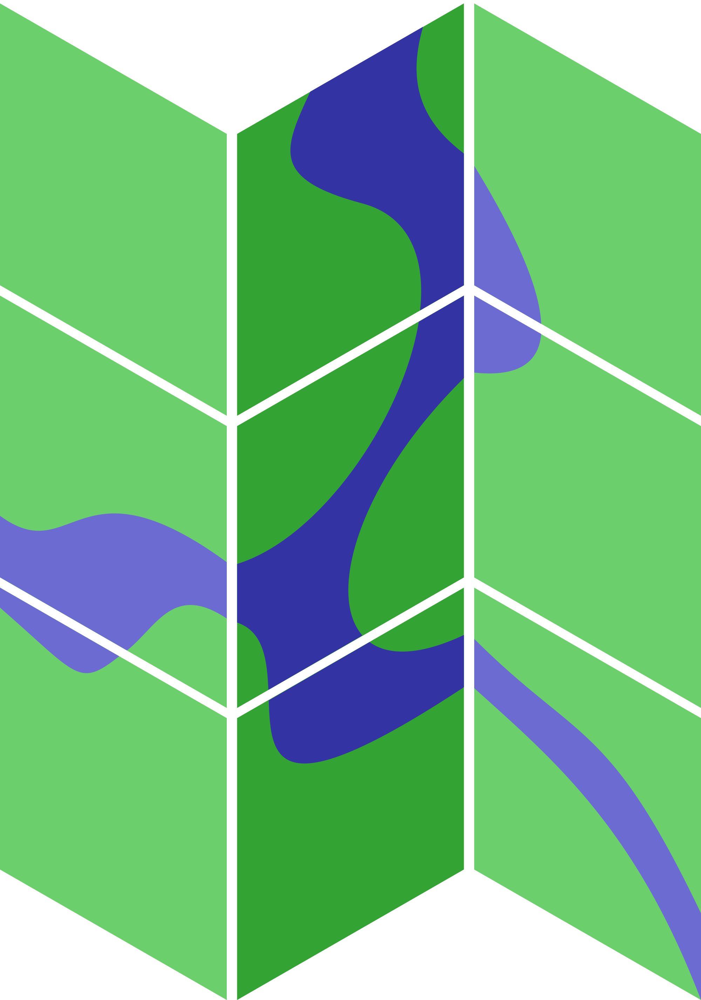

**MapServer** je
multiplatformní serverový mapový server určení pro publikaci prostorových dat
prostřednictvím webových služeb OGC a prostřednictvím proprietárního rozhraní.

MapServer (http://mapserver.org) je jeden z nejdéle vyvíjených programů pro
tento účel, původně jako projekt NASA. V současnosti je MapServer vyvíjen
komunitou uživatelů a vývojářů. MapServer je považován za nejrychlejší software
svého druhu.

MapServer je možné konfigurovat pomocí textového konfiguračního souboru (tzv.
`mapfile`), ale je možné jeho knihovny používat i z různých programovacích
jazyků (Perl, Python, PHP, Java, ...).

.. important:: Školení je zaměřeno na verzi `MapServer 7.x`, 
               pokud není uvedeno jinak, tak všechny uvedené postupy
               jsou funkční i ve verzi MapServer 6.x. Případné rozdíly mezi
               těmito verzemi jsou vždy explicitně zdůrazněny. Dále
               předpokládáme nainstalovaný webový server (`Apache
               <http://httpd.apache.org>`_) a textový editor.
 
Obsah
=====

Základy práce s programem MapServer
-----------------------------------

.. toctree::
    :maxdepth: 1

    uvod
    zakladni_konfigurace
    raster/index
    vector/index

MapServer Suite
---------------

.. toctree::
    :maxdepth: 1

    suite/index
    suite/tinyows/index
    suite/mapcache/index

MapScript
---------

.. toctree::
    :maxdepth: 1

    mapscript/index

Související materiály
=====================

.. todo:: Zatím prázdné

Technická podpora
=================

* *(česky)* Mailing list `FreeGeoCZ
  <http://freegis.fsv.cvut.cz/gwiki/Emailov%C3%A1_konference_FreeGeoCZ>`_ (obecně Open Source GIS, nikoliv pouze GRASS)
 * `registrace
   <http://mailman.fsv.cvut.cz/mailman/listinfo/freegeocz>`_
 * `archiv <http://mailman.fsv.cvut.cz/pipermail/freegeocz/>`_
* *(anglicky)* Mezinárodní mailing list projektu MapServer
 * `registrace <http://lists.osgeo.org/mailman/listinfo/mapserver-users>`_
 * `archiv <http://lists.osgeo.org/pipermail/mapserver-users/>`_
   
.. *Komerční podpora v ČR*
           
.. * OpenGeoLabs s.r.o. ``podpora@opengeolabs.cz``

Užitečné odkazy
===============

* http://freegis.fsv.cvut.cz
* http://epsg.io

Licence
=======

.. table::
   :class: noborder

   +----------------------------------+-------------------------------------------------------------------------------------------------------------------------------------------------------+
   | .. image:: _static/cc-by-sa.png  | Text školení je licencován pod `Creative Commons Attribution-ShareAlike 4.0 International License <http://creativecommons.org/licenses/by-sa/4.0/>`_. |
   |           :width: 125px          |                                                                                                                                                       |
   +----------------------------------+-------------------------------------------------------------------------------------------------------------------------------------------------------+

