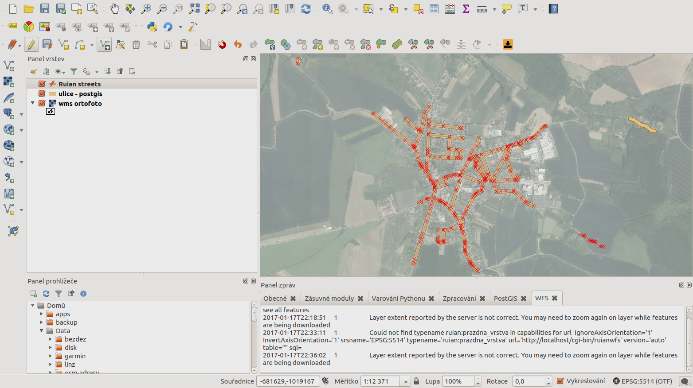

=========
Testování
=========

Z databáze RUIAN jsme stáhli data obce 573108 (Libáň) a pomocí `ogr2ogr` jsme je
nahráli do databáze PostgreSQL::

    ogr2ogr -f PostgreSQL PG:"dbname=ruian2 host=ruian2.crwpqfeduzzg.us-west-2.rds.amazonaws.com user=ja***** password=r*******db" -s_srs "+init=epsg:5514" -t_srs "+init=epsg:3857" ~/Stažené/20161231_OB_573108_UKSH.xml.gz

Nakonfigurovali jsme lokálně běžící instanci TinyOWS::

        <tinyows online_resource="http://localhost/cgi-bin/tinyows"
                schema_dir="/usr/share/tinyows/schema/"
                check_schema="0" >

         <pg host="ruian2.crwpqfeduzzg.us-west-2.rds.amazonaws.com" user="j*****" password="r***********db" dbname="ruian2" port="5432"/>

         <metadata name="TinyOWS Server"
                   title="TinyOWS Server - Demo Service" />

         <contact name="GISMentors" site="http://gismentors.cz" email="info@gismentors.cz"
                 individual_name="Jachym Cepicky" position="Lector" />

         <layer retrievable="1"
                writable="1"
                ns_prefix="ruian"
                ns_uri="http://gismentors.cz/ruian/roads/"
                name="streets"
                table="ulice"
                title="Ruian streets" />

        </tinyows>

A otestovali příkazem `wget`::

    wget -O - "http://localhost/cgi-bin/ruianwfs?service=wfs&request=getcapabilities"

Výsledek je `WFS_Capabilities` dokument::

        <?xml version='1.0' encoding='UTF-8'?>
        <WFS_Capabilities version='1.1.0' updateSequence='0' xmlns='http://www.opengis.net/wfs' xmlns:xsi='http://www.w3.org/2001/XMLSchema-instance' xmlns:ogc='http://www.opengis.net/ogc' xmlns:gml='http://www.opengis.net/gml' xmlns:ows='http://www.opengis.net/ows' xmlns:xlink='http://www.w3.org/1999/xlink' xsi:schemaLocation='http://www.opengis.net/wfs http://schemas.opengis.net/wfs/1.1.0/wfs.xsd' >
         <ows:ServiceIdentification>
          <ows:Title>TinyOWS Server - Demo Service</ows:Title>
          <ows:ServiceType>WFS</ows:ServiceType>
          <ows:ServiceTypeVersion>1.0.0</ows:ServiceTypeVersion>
          <ows:ServiceTypeVersion>1.1.0</ows:ServiceTypeVersion>
         </ows:ServiceIdentification>
         <ows:ServiceProvider>
          <ows:ProviderName>GISMentors</ows:ProviderName>
          <ows:ProviderSite xlink:href="http://gismentors.cz" />
          <ows:ServiceContact>
           <ows:IndividualName>Jachym Cepicky</ows:IndividualName>
           <ows:PositionName>Lector</ows:PositionName>
           ....

Přidání nové vrstvy WFS do programu QGIS:

.. note:: Pro hladký průběh je potřeba explicitně nastavit verzi WFS 1.0 a
        `check_schema` parametr v konfiguraci TinyOWS musí být nastaven na `0`.

    Přidání služby WFS

    Přidání nové vrstvy ze služby WFS

    Zobrazení vrstvy WMS ortofoto, dat z databáze PostgreSQL přímo a
    prostřednictvím služby WFS

Nyní můžeme data upravovat

    Zahájíme editaci

    
    Provedeme změny

    
    Uložíme změny - změny se propíšou do databáze a po překreslení jsou obě
    vrstvy opět stejné.
